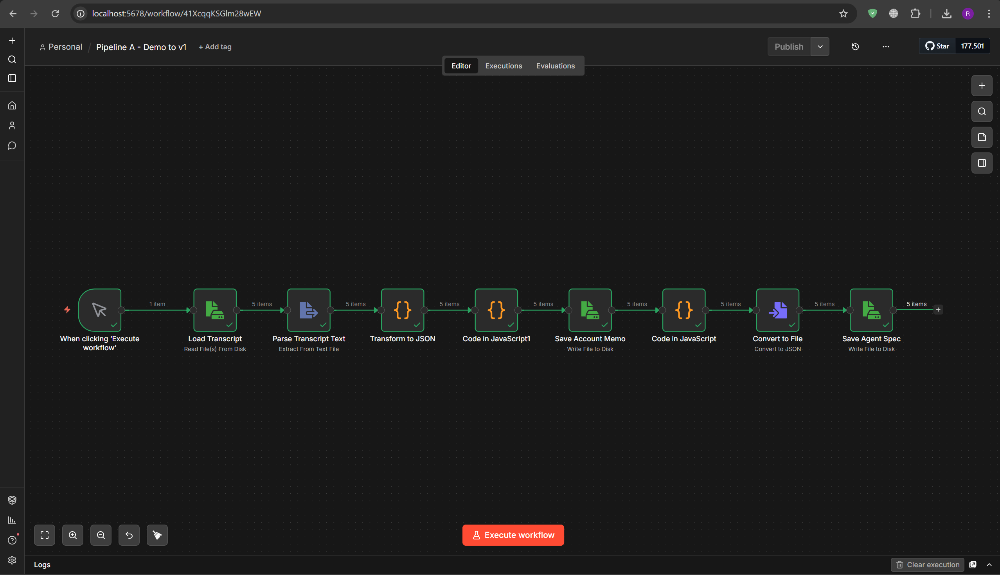
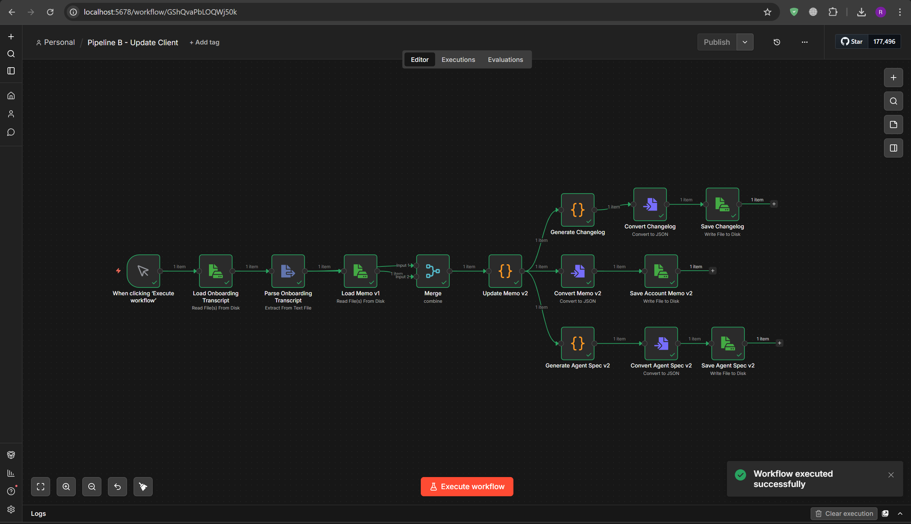
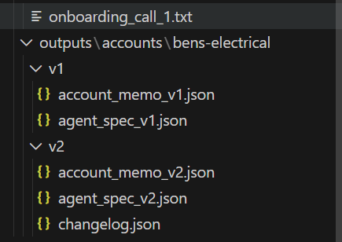

# Clara AI – Automation Pipeline Assignment

## Overview

This project implements an automation pipeline using **n8n** to simulate the onboarding and updating process for an AI call agent used by a service business. The system processes call transcripts, generates structured account information, and produces agent specifications that can be used for AI voice assistants.

In a real production environment, call transcripts could be generated using services such as Fireflies or other speech-to-text tools. In this project, transcripts are provided as text files to focus on the automation pipeline itself.

The solution consists of **two main pipelines**:

* **Pipeline A – Demo Call Processing (v1)**
* **Pipeline B – Onboarding Update and Agent Revision (v2)**

All workflows run locally using **n8n and Docker**, without any paid APIs or external services.

---

# Architecture

The system processes transcripts and generates structured outputs through automated workflows.

```
Demo Call Transcripts
        ↓
Pipeline A
        ↓
Account Memo v1
Agent Spec v1
        ↓
Onboarding Transcript
        ↓
Pipeline B
        ↓
Account Memo v2
Agent Spec v2
Changelog
```

---

# Pipeline A – Demo Call Processing

Pipeline A processes a batch of demo call transcripts and generates the initial configuration for an AI call assistant.

### Inputs

Located in:

```
n8n_files/demo
```

Files:

```
demo_call_1.txt
demo_call_2.txt
demo_call_3.txt
demo_call_4.txt
demo_call_5.txt
```

### Processing Steps

The workflow performs the following steps:

1. Load transcript files
2. Parse transcript text
3. Extract structured account information
4. Generate an **Account Memo (v1)**
5. Generate a **Retell Agent Draft Specification (v1)**
6. Store outputs to disk

### Outputs

Stored in:

```
outputs/accounts/bens-electrical/v1
```

Files generated:

```
account_memo_v1.json
agent_spec_v1.json
```

These files represent the **initial configuration of the AI assistant** based on the demo calls.

---


## Workflow Example

## Pipeline A – Demo Call Processing




# Pipeline B – Onboarding Update

Pipeline B simulates an onboarding call where additional business information becomes available and the system must update the agent configuration.

### Input

Onboarding transcript:

```
n8n_files/onboarding/onboarding_call_1.txt
```

Pipeline B performs:

1. Load onboarding transcript
2. Load the existing memo (v1)
3. Merge onboarding information with existing account data
4. Update business details
5. Generate updated artifacts

---

## Pipeline B – Onboarding Update




# Outputs – Version 2

Stored in:

```
outputs/accounts/bens-electrical/v2
```

Files generated:

```
account_memo_v2.json
agent_spec_v2.json
changelog.json
```

## Example Generated Outputs



### Changes captured

The changelog documents updates between versions, including:

* Addition of business hours
* Updated team size
* Information captured during onboarding

This demonstrates **version-controlled agent configuration updates**.

---

# Project Structure

```
CLARA-AUTOMATION-PIPELINE
│
├ dataset
│
├ n8n_files
│   ├ demo
│   └ onboarding
│
├ outputs
│   └ accounts
│       └ bens-electrical
│           ├ v1
│           │   account_memo_v1.json
│           │   agent_spec_v1.json
│           │
│           └ v2
│               account_memo_v2.json
│               agent_spec_v2.json
│               changelog.json
│
├ workflows
│   pipeline_a.json
│   pipeline_b.json
│
├ scripts
│
└ docker-compose.yml
```

---


# How to Run the Project

### 1. Start n8n

From the project root:

```
docker compose up
```

Then open:

```
http://localhost:5678
```

---

### 2. Import Workflows

Import the workflows located in:

```
workflows/
```

* `Pipeline A - Demo to v1.json`
* `Pipeline B - Update Client.json`

---

### 3. Run Pipeline A

Execute the workflow to process demo transcripts.

This generates:

```
account_memo_v1.json
agent_spec_v1.json
```

---

### 4. Run Pipeline B

Execute the onboarding update workflow.

This generates:

```
account_memo_v2.json
agent_spec_v2.json
changelog.json
```

---

# Design Decisions

### n8n for Orchestration

n8n was used to visually orchestrate the pipelines, enabling modular data processing and easy debugging.

### JSON Artifacts

All outputs are stored as JSON files to ensure compatibility with downstream systems and version tracking.

### Versioned Output Structure

Outputs are organized by version:

```
v1 → initial configuration
v2 → updated configuration
```

This allows tracking of agent changes over time.

---

# Limitations

* Transcript parsing uses rule-based extraction and may require refinement for more complex conversations.
* Only a single onboarding call is processed, though the workflow supports batch processing.
* Agent behavior configuration is simplified for demonstration purposes.

---

# Demo

A short demonstration video shows:

* Running Pipeline A
* Running Pipeline B
* Generated outputs and version updates

---

# Author

Rayan Mohammed  
B.Tech Computer Science Engineering  
Vellore Institute of Technology (VIT)  
22BCE8791  
NEO301750  
GitHub: https://github.com/rayanhafees  
ZenTrades AI Placement Drive 
